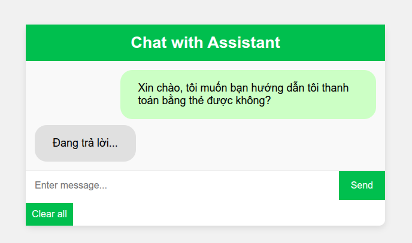
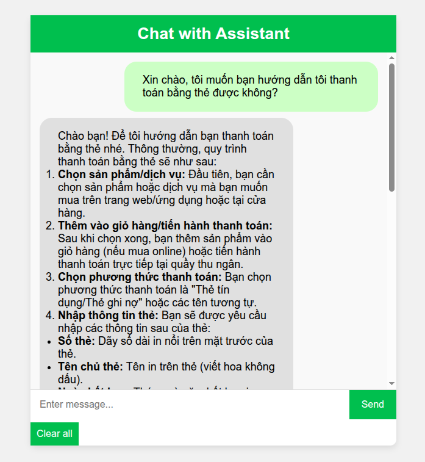
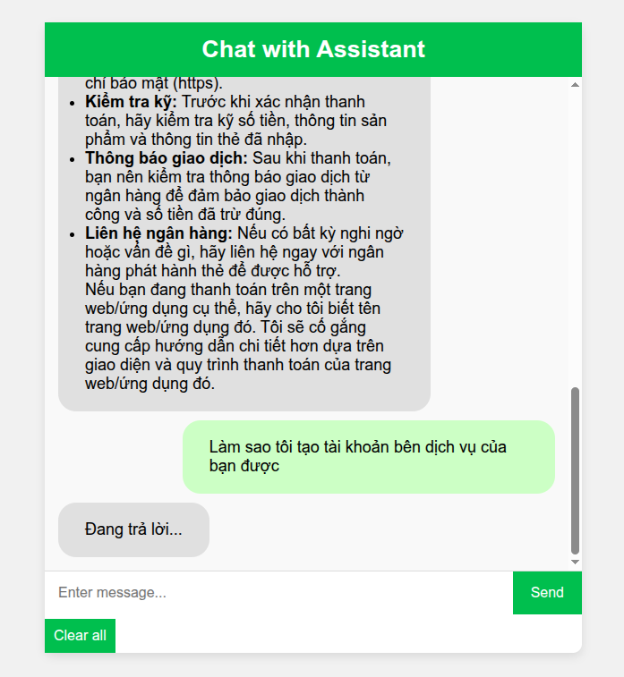
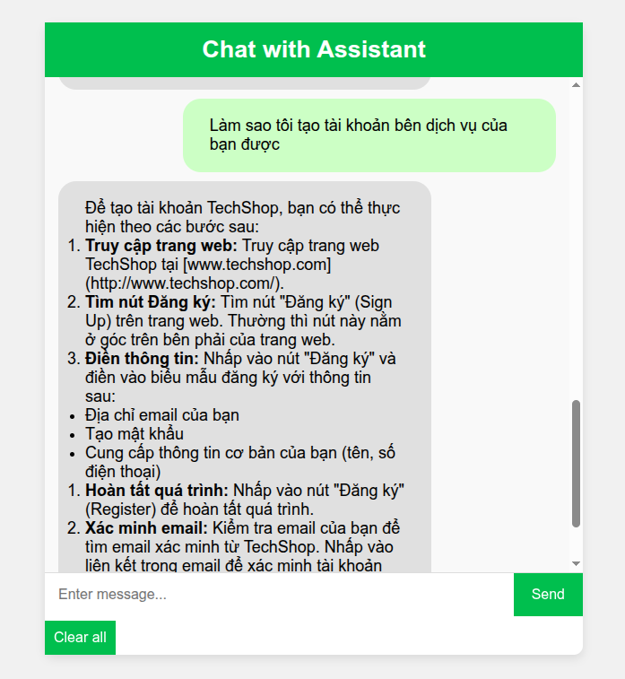

# 🤖 Gemini RAG Chatbot Assistant

**Gemini RAG Chatbot Assistant** is a web-based chatbot that uses Retrieval-Augmented Generation (RAG) in combination with Google’s Gemini AI model to answer user queries more accurately by referencing relevant documents. The interface is clean, intuitive, and supports basic Markdown formatting such as lists and bold text.

---

## Features

- Chat interface for user interaction with the AI via browser
- Integration with Gemini API using your own API key
- RAG-powered: fetches document snippets to enhance response quality
- Supports formatting:
  - `**bold text**` → `<b>`
  - `* unordered list` → `<ul><li>...</li></ul>`
  - `1. ordered list` → `<ol><li>...</li></ol>`
- HTML sanitization using `bleach` to prevent XSS
- Easy deployment with Docker

---

## How to Get a Gemini API Key

To use the Gemini model, you'll need a valid API key from Google. Follow these steps:

1. Go to: [https://makersuite.google.com/app/apikey](https://makersuite.google.com/app/apikey)
2. Log in with your Google account.
3. Click **"Create API key"**.
4. Copy and save the key for the next step.

---

## Running with Docker

You don’t need to install any dependencies — just Docker. Run this command:

```bash
docker run -d \
  --name chatbot \
  -p 3000:3000 \
  -e GEMINI_API_KEY=<your_gemini_api_key> \
  -e SESSION_SECRET_KEY=<your_session_secret_key> \
  qctrung/gemini-ragchatbot-assistant
````

Replace:

* `<your_gemini_api_key>` with the API key you got from Google.
* `<your_session_secret_key>` with a custom string to secure Flask session (e.g., `"supersecret123"`).

Once running, open your browser and go to: [http://localhost:3000](http://localhost:3000)

---

## User Interface

Built using pure HTML and CSS — no build step needed. Highlights:

* Clean and responsive chat UI
* Auto-scrolls to the latest message
* Bold text and list rendering supported
* Scrollable chat container (instead of scrolling the entire page)
* Chat history stored in Flask session memory

### Demo









---

## Project Structure

```
.
├── ./app.py
├── ./corpus
│   ├── ./corpus/techshop-faq.pdf
│   ├── ./corpus/techshop-troubleshooting-guide.pdf
│   └── ./corpus/techshop-user-guide.pdf
├── ./Dockerfile
├── ./README.md
├── ./requirements.txt
├── ./src
│   ├── ./src/gemini_rag_model.py
│   ├── ./src/__init__.py
│   └── ./src/utils.py
├── ./static
│   ├── ./static/script.js
│   └── ./static/style.css
└── ./templates
    └── ./templates/index.html
```

---

## How It Works (Technical Details)

The chatbot uses **RAG (Retrieval-Augmented Generation)** to ground its responses in your own documents. Here's how it works under the hood:

### Document Loading

When the application starts:

1. It scans the `corpus/` directory for PDF files.
2. It reads and uploads these files to **Gemini's cached cloud storage** using the `google.genai` Python client.
3. These uploaded documents form a **persistent context** available during chatbot interactions.

### Inference Flow

Every time the user sends a message:

1. The `prompt` is combined with the previously uploaded documents (`self.corpus`) as input to the Gemini model.
2. The model (`gemini-2.0-flash`, by default) is queried with:

```python
contents = [
    *self.corpus,
    prompt
]
```

3. Gemini generates a response grounded in the uploaded documents.
4. The raw response is then passed through formatting & sanitization steps before being displayed to the user.

> This allows your chatbot to provide **accurate and relevant answers** based on your actual website documents (e.g., guides, help center, terms, etc.).

---

## Corpus Folder Structure

Make sure your PDFs are placed inside a `corpus/` directory at the root of the project:

```
corpus/
├── intro.pdf
├── faq.pdf
└── user-guide.pdf
```

You can customize this list as needed. The model supports any number of files as long as it fits Gemini’s API input constraints.

---

## Security Notes

* Never commit your `.env` or real API keys to a public repository.
* API keys and secret keys should be passed via environment variables (as shown in the Docker command).
* All chatbot responses are sanitized with `bleach` to prevent script injection (XSS).

---

## Thanks for using this project!

Developed by [@lngquoctrung](https://github.com/lngquoctrung).
Feel free to open an issue, contribute, or ask questions!

---

Let me know if you'd like to:

- Add badges (e.g., Docker Pulls, Build Passing)
- Include automated deployment instructions
- Generate a `.env.example` or Docker Compose setup

I'm happy to assist with polishing or expanding the docs further!